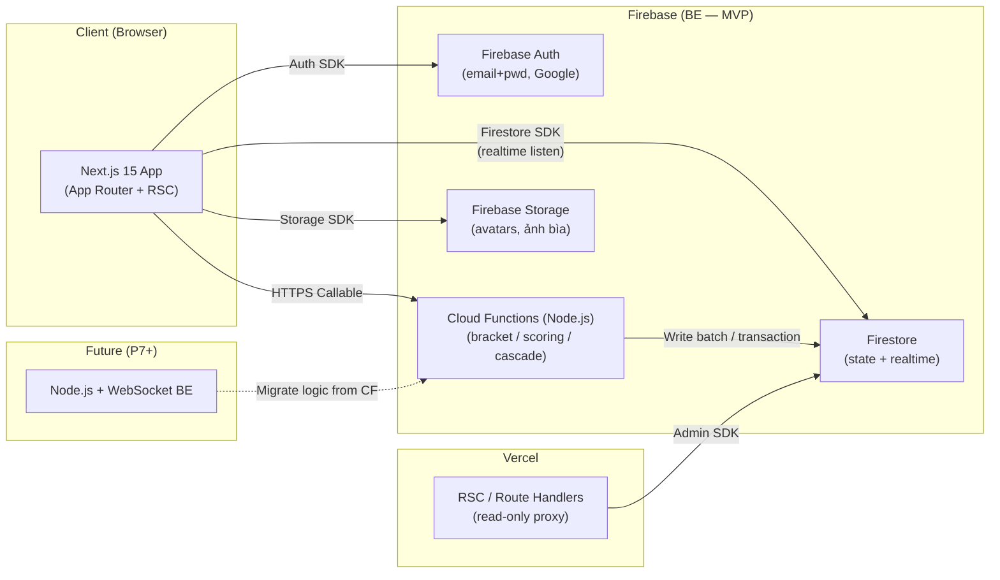
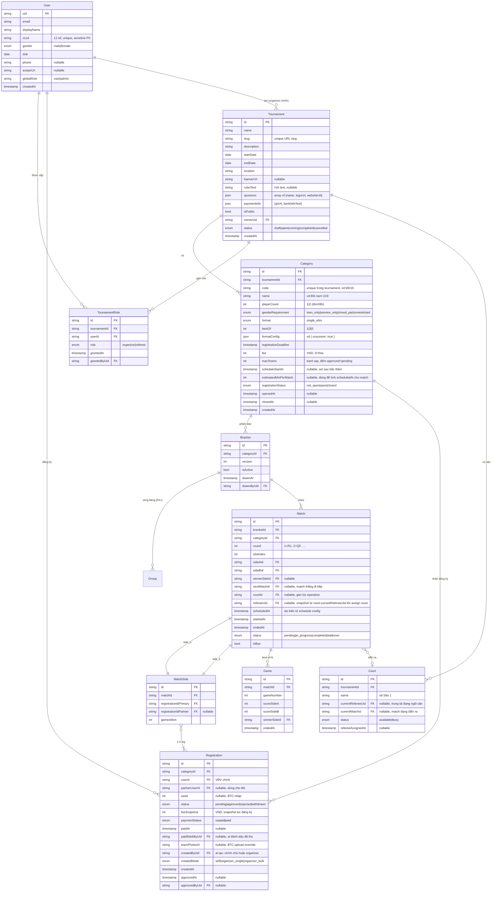

# System Architecture — Badminton Tournament Platform

> **Status:** Draft v0.1
> **Ngày:** 2026-05-28
> **Kèm:** [project-overview-pdr.md](project-overview-pdr.md)

---

## 1. High-Level Architecture



**Quy tắc phân chia trách nhiệm:**

| Layer | Nhiệm vụ |
|---|---|
| **Next.js Client** | UI, form validation, Firestore listener (realtime), upload Storage trực tiếp |
| **Next.js Server (RSC)** | Render public bracket page (cache CDN), SEO, sitemap |
| **Cloud Functions** | Mọi mutation có business rule: bốc thăm, sinh bracket, advance winner, withdrawal cascade, cấp role, mời trọng tài |
| **Firestore Security Rules** | Defense in depth: phân quyền read/write minimum |

**Lý do tách CF cho mọi mutation logic:**
- Client không trust được → không cho client viết Match trực tiếp.
- Logic portable: 1 file `lib/bracket/*.ts` thuần (không import firebase) + 1 adapter mỏng → migrate Node.js BE chỉ thay adapter.

## 2. Tech Stack

| Layer | Choice | Version | Lý do |
|---|---|---|---|
| Frontend framework | Next.js | 15 (App Router) | RSC cho public page, SEO, đã chốt |
| UI library | shadcn/ui + Tailwind | latest | Accessible, dễ tuỳ biến, KISS |
| State client | TanStack Query + Zustand (tối thiểu) | latest | Realtime data từ Firestore listener |
| Forms | React Hook Form + Zod | latest | Type-safe, validate share giữa client + CF |
| Auth | Firebase Auth | v10+ | Đã chốt |
| DB | Firestore | — | Đã chốt |
| Backend logic | Firebase Cloud Functions Gen 2 (Node.js 20 + TS) | latest | HTTPS callable + Firestore trigger |
| Storage | Firebase Storage | — | Avatar, ảnh bìa |
| Hosting FE | Vercel | — | Edge cache cho public route |
| CI/CD | GitHub Actions + Vercel + Firebase CLI deploy | — | |
| Monitoring | Vercel Analytics + Firebase Console | — | Đủ MVP |
| Language | TypeScript strict | — | |
| Testing | Vitest (unit) + Playwright (e2e) | — | E2E ưu tiên cho bracket flow |

## 3. Domain Model (ERD)



### Quy tắc model

1. **`Registration` là khoá nối** giữa User và Category — KHÔNG dùng `userId` trực tiếp trong Match. Lý do: hỗ trợ đôi (2 user/side) + tracking withdrawal độc lập với hồ sơ user.
2. **`Bracket` versioned**: re-arrange = tạo bracket mới, set `isActive=true`, bracket cũ `isActive=false`. Không xoá.
3. **`Match.nextMatchId`** lưu sẵn lúc gen bracket → advance winner = O(1) update.
4. **`Match.isBye=true`** = match tự thắng cho side có đăng ký, side kia là phantom. `status` set `completed` ngay khi sinh bracket.
5. **`MatchSide.gamesWon`** denormalize từ Game để truy vấn nhanh, cập nhật khi kết thúc game.
6. **Withdrawal cascade**: khi `Registration.status = withdrawn`, CF tìm tất cả Match có Side chứa registration đó **với status `pending` hoặc `in_progress`** (KHÔNG đụng match `completed` — lịch sử bất biến), set `status=walkover`, side đối diện thắng + tự đẩy lên `nextMatch`. Match đang `in_progress` mà bị walkover → cũng release court (`court.currentMatchId = null`). Đôi: 1 trong 2 VĐV rút = cả cặp `withdrawn`.
7. **`Match.refereeUid`** (snapshot): set TỰ ĐỘNG khi organizer gán match vào court — copy từ `court.currentRefereeUid` tại thời điểm assign. Là **gate** cho quyền nhập điểm: `uid == match.refereeUid` mới score được. Organizer luôn override. Đổi `court.currentRefereeUid` sau đó KHÔNG ảnh hưởng match đã snapshot (rule MVP).
8. **Quyền edit điểm**:
   - Referee: chỉ match được gán + trong 24h sau `endedAt`.
   - **Organizer: bất kỳ match nào, không giới hạn thời gian** — kể cả match đã `completed`.
   - Nếu edit thay đổi `winnerSideId` của match đã advance: **CASCADE REVERT** toàn bộ dây chuyền các match downstream mà loser cũ đã tham gia, sau đó re-advance winner mới. Chi tiết ở mục 4.x bên dưới.
   - UI **bắt buộc hiển thị confirm dialog** liệt kê tất cả match sẽ bị reset trước khi commit.
   - Mọi edit ghi audit log: `editedByUid`, `previousScore`, `newScore`, `winnerChanged: bool`, `revertedMatchIds: string[]`.

## 4. Firestore Schema (collection layout)

Dùng **nested subcollections** theo cây tournament + **collection group queries** cho truy vấn chéo.

```
users/{userId}
├── (public fields: displayName, gender, dob, avatarUrl, globalRole, createdAt)
├── private/identity                     # 1 doc fixed id; read = owner + admin only
│   └── { cccd: string, phone: string, email: string }
└── notifications/{notifId}              # P3+

cccdIndex/{cccd}                         # Lookup uniqueness; NO client read access
└── { userId: string, createdAt: timestamp }

tournaments/{tournamentId}
├── (fields: Tournament entity, incl. sponsors[], paymentInfo, bannerUrl, rulesText)
├── roles/{userId}                       # TournamentRole — doc id = userId để unique
├── courts/{courtId}                     # incl. currentRefereeUid, currentMatchId, status
├── categories/{categoryId}
│   ├── (fields: Category entity, incl. code, deadline, fee, maxTeams, schedule config)
│   ├── registrations/{registrationId}   # incl. paymentStatus, feeSnapshot, teamPhotoUrl
│   ├── brackets/{bracketId}
│   ├── matches/{matchId}
│   │   ├── (fields: Match entity, incl. refereeUid snapshot)
│   │   ├── games/{gameNumber}
│   │   └── sides/{sideId}               # 2 docs: side_a, side_b
│   └── ranking/{userId}                 # P6+
└── audit/{eventId}                      # immutable audit log
```

**Note về `code` Category:** unique trong tournament được enforce qua CF (đọc tất cả category cùng tournament, check). Không cần index doc riêng (volume nhỏ).

### Collection group queries cần thiết

| Truy vấn | Cách | Index |
|---|---|---|
| Tất cả giải user X đăng ký | CG `registrations` where `userId == X` | composite (userId, status) |
| Tất cả match user X thi đấu | CG `sides` where `userIds array-contains X` (denormalize `userIds: [primary, partner]` vào sides) | array-contains |
| Tất cả role user X có | CG `roles` where `__name__ == X` | (built-in) |
| Match có 1 trong 2 side là VĐV X trong khung giờ Y | CG `matches` where `userIds array-contains X` + range scheduledAt | composite |

### Denormalize fields trên `Match`

```
matches/{matchId}
{
  ...Match entity,
  participantUserIds: ["uid1", "uid2", "uid3", "uid4"]   // tất cả VĐV trong 2 sides
  participantRegistrationIds: ["regA1", "regA2", "regB1", "regB2"]
}
```

Lý do: phục vụ schedule conflict warning ở UI bằng 1 query trên client.

## 5. Cloud Functions structure

```
functions/
└── src/
    ├── domain/                                # Logic thuần, KHÔNG import firebase-*
    │   ├── bracket/
    │   │   ├── single-elim-generator.ts       # input: registrations + seeds → matches[]
    │   │   ├── advance-winner.ts              # input: match + winner → updates[]
    │   │   ├── withdrawal-cascade.ts          # input: registration + bracket → updates[]
    │   │   ├── cascade-revert.ts              # input: match + new winner → list match cần revert + re-advance
    │   │   └── bye-allocator.ts
    │   ├── scoring/
    │   │   └── compute-match-winner.ts        # input: games[], bestOf → winnerSide
    │   ├── validation/
    │   │   ├── gender-requirement.ts              # validate theo Category.genderRequirement (men/women/mixed/unrestricted)
    │   │   ├── cccd-format.ts                     # validate 12 số, all digits
    │   │   ├── category-config.ts                 # validate mixed_pair + playerCount=2 only
    │   │   └── partner-eligibility.ts
    │   └── types.ts                           # types thuần, KHÔNG có FieldValue
    ├── adapters/
    │   └── firestore/                         # Mỏng — đọc/ghi Firestore
    │       ├── bracket-repo.ts
    │       ├── match-repo.ts
    │       └── registration-repo.ts
    ├── handlers/                              # HTTPS callable + Firestore triggers
    │   ├── auth/
    │   │   ├── complete-profile.ts            # signup step 2: validate CCCD + transaction tạo user + cccdIndex
    │   │   └── admin-update-cccd.ts           # admin override CCCD (P5+)
    │   ├── tournament/
    │   │   ├── grant-tournament-role.ts
    │   │   └── toggle-public.ts
    │   ├── category/
    │   │   ├── create-category.ts             # validate code unique trong tournament
    │   │   ├── update-category-config.ts      # banner/rules/sponsors/fee/deadline/maxTeams
    │   │   ├── set-schedule-config.ts         # scheduleStartAt + estimatedMinPerMatch + tính scheduledAt cho match
    │   │   ├── open-registration.ts           # not_open → open
    │   │   ├── close-registration.ts          # open → closed (guard: 0 pending)
    │   │   └── reopen-registration.ts         # closed → open (trước bốc thăm)
    │   ├── registration/
    │   │   ├── create-registration.ts         # self: validate isPublic + open + deadline + maxTeams + gender
    │   │   ├── organizer-create-registration.ts  # single: auto approved
    │   │   ├── organizer-bulk-create.ts       # bulk: validate từng dòng, partial commit, return success/error list
    │   │   ├── approve-registration.ts
    │   │   ├── reject-registration.ts
    │   │   ├── withdraw.ts
    │   │   ├── mark-paid.ts                   # đánh dấu paid
    │   │   ├── unmark-paid.ts                 # đánh dấu nhầm, revert
    │   │   ├── set-registration-seed.ts       # BTC set/clear Registration.seed ở phase config đội
    │   │   └── upload-team-photo.ts           # BTC override teamPhotoUrl
    │   ├── bracket/
    │   │   ├── draw-bracket.ts                # callable: input categoryId + seeds → tạo bracket + matches
    │   │   ├── rearrange-bracket.ts           # callable: swap 2 slot → new version
    │   │   └── reset-bracket.ts               # huỷ bracket trước giải bắt đầu
    │   ├── match/
    │   │   ├── start-match.ts
    │   │   ├── record-game-score.ts
    │   │   ├── end-match.ts                   # tính winner → advance
    │   │   ├── edit-score.ts                  # referee: 24h window; organizer: anytime
    │   │   ├── preview-cascade-revert.ts      # dry-run: trả list match sẽ bị reset nếu winner đổi (UI confirm)
    │   │   └── assign-match-to-court.ts       # snapshot referee từ court, set court busy
    │   ├── court/
    │   │   ├── create-court.ts
    │   │   ├── assign-referee-to-court.ts     # gán/đổi trọng tài hiện tại của sân
    │   │   └── release-court.ts               # manual release (auto khi match end thường)
    │   └── admin/
    │       └── grant-global-role.ts
    ├── middleware/
    │   ├── auth-guard.ts                      # check Firebase Auth token
    │   └── role-guard.ts                      # check global/tournament role
    └── index.ts                               # export tất cả CF
```

**Migration path (P7+):**
- `domain/` copy nguyên xi sang Node.js BE.
- `adapters/firestore/` thay bằng `adapters/postgres/` (hoặc giữ Firestore Admin SDK).
- `handlers/` thay đổi từ Firebase HTTPS callable sang Express route + WebSocket.

## 6. Authorization model

### Quy tắc đọc dữ liệu (read)

| Resource | Cho phép read |
|---|---|
| `users/{uid}` (public fields: displayName, gender, avatar, dob) | mọi user đăng nhập |
| `users/{uid}` (sensitive: **cccd**, phone, email) | chính chủ + admin |
| `cccdIndex/*` | **KHÔNG ai** (chỉ CF Admin SDK đọc qua transaction) |
| `tournaments/{tid}` (isPublic=true) | mọi người, kể cả guest |
| `tournaments/{tid}` (isPublic=false) | organizer của tid + participant của tid + admin |
| `tournaments/{tid}/categories/{cid}` (meta: name, format, bestOf, status) | theo rule tournament (public nếu isPublic, riêng nếu private) |
| `tournaments/{tid}/categories/{cid}/registrations/*` (chính chủ) | chính chủ — luôn xem được đăng ký của mình |
| `tournaments/{tid}/categories/{cid}/registrations/*` (toàn bộ — danh sách VĐV approved) | **public CHỈ KHI** `category.registrationStatus = closed` AND `tournament.isPublic = true`; organizer + admin: luôn xem được mọi status |
| `tournaments/{tid}/categories/{cid}/registrations/*` (sensitive: paymentStatus, feeSnapshot, paidMarkByUid) | organizer + chính chủ + admin (không public dù closed) |
| `tournaments/{tid}/matches/*` | theo rule của tournament + chỉ khi bracket đã sinh (sau khi category locked) |
| `tournaments/{tid}/audit/*` | organizer + admin |

**Lưu ý PII**: Trên Firestore docs trả về client, field `cccd` phải được **loại bỏ ở Cloud Function projection** khi requester không phải owner/admin. Có 2 cách:
- (a) Lưu cccd trong subdoc `users/{uid}/private/identity` với rule chặt riêng.
- (b) Dùng Firestore Rules với field-level access (không có sẵn) → KHÔNG khả thi, phải dùng (a).
- **Chọn (a)**: tách subdoc.

### Quy tắc ghi (write) — chỉ qua Cloud Functions

Client KHÔNG có quyền write `tournaments/`, `matches`, `registrations` trừ:
- Tạo registration mới của chính mình (CF check thêm).
- Update profile của chính mình.

Mọi mutation khác (approve, draw, score) → **HTTPS Callable Cloud Function** với role check.

## 7. Firestore Security Rules (outline)

```javascript
rules_version = '2';
service cloud.firestore {
  match /databases/{database}/documents {

    function isSignedIn() { return request.auth != null; }
    function uid() { return request.auth.uid; }
    function isAdmin() {
      return isSignedIn() &&
        get(/databases/$(database)/documents/users/$(uid())).data.globalRole == 'admin';
    }
    function isOrganizer(tid) {
      return isSignedIn() &&
        exists(/databases/$(database)/documents/tournaments/$(tid)/roles/$(uid())) &&
        get(/databases/$(database)/documents/tournaments/$(tid)/roles/$(uid())).data.role == 'organizer';
    }

    match /users/{userId} {
      allow read: if isSignedIn();         // public fields
      allow write: if false;               // chỉ qua CF

      match /private/{docId} {
        allow read: if uid() == userId || isAdmin();
        allow write: if false;             // chỉ qua CF
      }
    }

    match /cccdIndex/{cccd} {
      allow read, write: if false;         // chỉ CF Admin SDK
    }

    match /tournaments/{tid} {
      allow read: if resource.data.isPublic == true || isOrganizer(tid) || isAdmin();
      allow create: if isSignedIn();      // CF sẽ verify global role 'organizer-capable'
      allow update, delete: if false;     // chỉ qua CF
    }

    match /tournaments/{tid}/{document=**} {
      allow read: if get(/databases/$(database)/documents/tournaments/$(tid)).data.isPublic == true
                  || isOrganizer(tid)
                  || isAdmin();
      allow write: if false;              // tất cả qua CF
    }

    match /tournaments/{tid}/registrations/{regId} {
      // Đè rule trên — cho phép user tạo registration của chính mình
      allow create: if isSignedIn() && request.resource.data.userId == uid();
    }
  }
}
```

Chi tiết hoá ở P1.

## 8. Data flow — Key journeys

### 8.1 Category lifecycle (3 trạng thái)

```
[Organizer setup]
  Tạo Category → registrationStatus = 'not_open'
    ↓ openRegistration({categoryId})
  registrationStatus = 'open', openedAt = now
    → VĐV đăng ký được khi:
        - tournament.isPublic = true
        - now < category.registrationDeadline
        - (approved + pending count) < category.maxTeams
    ↓ closeRegistration({categoryId})
    [GUARD: pending count must be 0]
  registrationStatus = 'closed', closedAt = now
    → Không nhận đăng ký mới
    → Danh sách VĐV approved hiển thị PUBLIC (kèm ảnh đội)
    → BTC sẵn sàng: thêm/sửa teamPhotoUrl, nhập seed, bốc thăm
  → (sau bốc thăm: implicit "drawn" — Bracket.isActive=true, không sửa registration thường)
```

**Transition rules (CF enforce):**
- `not_open → open`: cho phép (BTC bắt đầu nhận đăng ký)
- `open → closed`: cho phép — **CHỈ khi không còn registration `pending`** (CF count pending → reject nếu > 0, báo "Còn N pending, vui lòng duyệt/từ chối hết")
- `closed → open`: cho phép — **CHỈ khi chưa bốc thăm** (`Bracket.isActive == null`)
- Sau bốc thăm: không transition qua flow thường (admin override CF riêng)

**Đăng ký mới (CF `createRegistration`):**
1. `tournament.isPublic == true`
2. `category.registrationStatus == 'open'`
3. `now < category.registrationDeadline`
4. **Slot check**: `count(registrations where status IN [pending, approved]) < category.maxTeams`
5. Mixed doubles: gender check
6. Snapshot `feeSnapshot = category.fee`, `paymentStatus = 'unpaid'`
7. Default `status = 'pending'`

**Slot freed khi reject pending:** chỉ khi `oldStatus = pending AND newStatus = rejected` → slot count tự giảm (không cần update gì thêm vì query count động).

### 8.2 Signup với CCCD uniqueness

```
[Client signup form]
  → Validate format: CCCD = exactly 12 digits, all numeric
  → Firebase Auth: createUserWithEmailAndPassword (chỉ tạo auth user)
  → callable.completeProfile({ displayName, cccd, gender, dob, phone? })

[CF completeProfile]
  → middleware: auth-guard (must be just-signed-in user)
  → Validate cccd format server-side (12 digits)
  → Firestore Transaction:
    1. Read /cccdIndex/{cccd}
    2. If exists:
        - Delete the Firebase Auth user (rollback)
        - Throw "CCCD_ALREADY_REGISTERED"
    3. Else:
        - Create /users/{uid} (public fields)
        - Create /users/{uid}/private/identity (cccd, phone, email)
        - Create /cccdIndex/{cccd} = { userId: uid, createdAt }
  → Audit log signup

[Client]
  → On error CCCD_ALREADY_REGISTERED:
      hiển thị "CCCD này đã được đăng ký. Vui lòng đăng nhập hoặc dùng tính năng quên mật khẩu."
      (KHÔNG tiết lộ email/uid của owner cũ — privacy)
```

**Lưu ý:** Phải dùng transaction để tránh race condition khi 2 user đồng thời signup cùng CCCD (extremely rare nhưng có thể).

**Admin update CCCD** (P5+): CF callable `admin-update-cccd({userId, newCccd})` — transaction xoá cccdIndex cũ + tạo mới.

### 8.3 Bốc thăm bracket

**Tiền đề:** BTC đã `closed` category. Ở phase "Config đội" (cùng màn upload ảnh đội), BTC chọn set/clear `Registration.seed` cho từng đội qua `setRegistrationSeed`. Phase này không bắt buộc — có thể skip nếu muốn random toàn bộ.

```
[Organizer UI]
  ↓ Click "Bốc thăm"
[Client] callable.drawBracket({categoryId})       # CHỈ truyền categoryId
  ↓
[CF drawBracket]
  → middleware: auth + role-guard(organizer of tid)
  → Read category → assert status='closed'
  → Read approved registrations
  → Đếm seededCount = registrations.filter(r.seed != null).length
  → mode = seededCount > 0 ? 'seeded' : 'random'    # AUTO-DETECT
  → Validate (regs >= 2, seeded values unique + in [1,N])
  → domain/bracket/single-elim-generator(regs, mode)
    → return matches[], bracket meta
  → Firestore batch (atomic):
      - create bracket doc (version = max+1, isActive=true)
      - mark old bracket isActive=false
      - create matches/ sides/ docs
  → Audit log (mode, seedSnapshot)
  ↓
[Client] Firestore listener tự cập nhật UI
```

**`setRegistrationSeed({registrationId, seed | null})`** — endpoint riêng, gọi ở phase config đội:
- Guard: organizer của tournament, category.registrationStatus = 'closed', chưa có bracket active.
- `seed = null` → clear seed (back to unseeded).
- Validate seed value: integer ≥ 1.
- KHÔNG validate uniqueness ở set level — chỉ validate khi drawBracket (vì BTC có thể đang trong quá trình điều chỉnh).

### 8.4 Nhập điểm + kết thúc trận

```
[Referee UI]
  → recordGameScore({matchId, gameNumber, scoreA, scoreB})
    → CF: auth-guard + check (uid == match.refereeUid) OR isOrganizer(tid)
    → write game doc; update side.gamesWon
  ... (lặp lại N game)
  → endMatch({matchId})
    → CF: same guard
    → compute-match-winner(games, bestOf) → winnerSideId
    → set match.status=completed, winnerSideId
    → if nextMatchId: set next match's appropriate side = winnerSide registrations
    → Audit log
```

### 8.5 Organizer edit điểm — cascade revert chain

Trường hợp: match M đã `completed`, winner cũ đã đẩy lên `nextMatch`, có thể đã thi đấu hoặc đẩy tiếp. Organizer sửa điểm M → winner đổi.

**Thuật toán `cascade-revert.ts` (domain layer, thuần):**

```
function cascadeRevert(matchM, newWinnerSide, allMatches):
  affected = []
  cursor = matchM.nextMatchId
  loserSideOld = winner cũ của M (giờ thành loser)

  while cursor != null:
    next = allMatches[cursor]
    # Kiểm tra: trận này có chứa loserSideOld không?
    if next chứa registration của loserSideOld:
      affected.push(next)
      # Reset trận này
      next.status = 'pending'
      next.winnerSideId = null
      next.startedAt = null
      next.endedAt = null
      # Side nào chứa loserSideOld → set lại slot đó là TBD (waiting)
      # Xoá tất cả games của next (sẽ làm ở adapter layer)

      # Tiếp tục lên trên (next.nextMatchId) nếu next đã có winner trước đó
      if next.winnerSideId-cũ != null:
        cursor = next.nextMatchId
        loserSideOld = winner cũ của next
      else:
        break
    else:
      break  # không liên quan, dừng

  return { affected, gamesToDelete }
```

**Flow đầy đủ:**

```
[Organizer UI — clicks "Edit điểm" trên match M]
  → callable.previewCascadeRevert({matchId})
    → CF dry-run: compute affected matches
    → return list { matchId, round, currentStatus, willBecome }

[UI confirm dialog]
  "Sửa điểm trận này sẽ reset 3 trận sau: QF#2, SF#1, F. Tiếp tục?"

[User confirms]
  → callable.editScore({matchId, games, newWinnerSide})
    → CF:
      - middleware: auth + organizer-guard
      - Compute cascade affected list
      - Atomic batch:
        * Update games của M
        * Update side.gamesWon của M
        * Set M.winnerSideId = newWinnerSide
        * For each affected match:
          - status = pending
          - clear winnerSideId, startedAt, endedAt
          - Delete tất cả games subcollection
          - Update side đang chứa loser cũ → ghi registration của winner mới (chain advance)
        * Re-advance từ M → nextMatch (đặt side đúng = winner mới)
      - Write audit log (revertedMatchIds, oldWinner, newWinner)
```

**Constraint quan trọng:**
- Cascade revert KHÔNG đụng tới match không liên quan (loser cũ không tham gia) → giữ nguyên.
- Match `in_progress` trong chain (đang đánh) cũng bị reset → UI cảnh báo riêng mạnh hơn.
- Firestore batch giới hạn 500 ops → nếu chain vượt (lý thuyết bracket 1024 người = 10 round), chia batch + transaction guarded.

### 8.6 Operations Console — model 2 cấp: trọng tài gán sân, match gán sân

**Cấp 1 — Gán trọng tài vào Court:**
```
[Organizer UI] → assignRefereeToCourt({courtId, refereeUid | null})
  → CF: auth + organizer-guard + validate refereeUid có role 'referee' trên tournament
  → court.currentRefereeUid = refereeUid
  → court.refereeAssignedAt = now
  → Audit log
```

**Cấp 2 — Gán Match vào Court:**
```
[Organizer UI — kéo match vào sân available]
  → assignMatchToCourt({matchId, courtId})
  → CF:
    - validate court.status == 'available' AND court.currentMatchId == null
    - validate court.currentRefereeUid != null (sân phải có trọng tài)
    - validate match.status == 'pending'
    - Firestore transaction:
        * match.courtId = courtId
        * match.refereeUid = court.currentRefereeUid   # SNAPSHOT
        * court.currentMatchId = matchId
        * court.status = 'busy'
    - Audit log
```

**Auto-release khi match kết thúc:**
```
[endMatch handler — sau khi compute winner]
  → Firestore transaction:
    * match.status = 'completed' (hoặc 'walkover')
    * IF match.courtId != null:
        - court.currentMatchId = null
        - court.status = 'available'
        # currentRefereeUid GIỮ NGUYÊN — trọng tài còn ngồi sân
    * Advance winner → nextMatch (như flow 8.4)
```

**Đổi trọng tài khi match đang chạy:**
- `assignRefereeToCourt({courtId, newRefereeUid})` thay đổi `court.currentRefereeUid` nhưng **KHÔNG đụng `match.refereeUid` của match đang chạy** (snapshot preserved — rule MVP).
- Match đang chạy: trọng tài cũ vẫn là người duy nhất nhập điểm.
- Match tiếp theo gán vào sân: snapshot trọng tài mới.

**Referee UI nhìn gì:**
```
CG query: matches where refereeUid == uid AND status in (pending, in_progress)
→ Chỉ thấy nút "Nhập điểm" / "Bắt đầu" / "Kết thúc" cho các match được gán
```

### 8.7 Withdrawal cascade

**Rule cốt lõi:** Match đã `completed` của VĐV rút → **GIỮ NGUYÊN** (lịch sử bất biến). Chỉ match `pending` / `in_progress` mới bị walkover.

```
[VĐV UI hoặc Organizer]
  → withdraw({registrationId})
    → CF: set registration.status=withdrawn
    → domain/bracket/withdrawal-cascade(reg, activeBracket)
      → find matches có side chứa reg AND status IN (pending, in_progress)
        # KHÔNG touch match completed
      → for each:
          - set status=walkover
          - winnerSideId = side đối diện
          - endedAt = now
          - games subcollection để trống (không có điểm)
      → propagate winners lên chain via nextMatchId
        # đệ quy: side đối diện tự thắng → push lên next match → nếu next cũng có side toàn người walkover thì lại push tiếp
    → Firestore batch atomic
    → Audit log (withdrawnByUid, affectedMatchIds, propagationChain)
```

**Trường hợp đôi:** Khi 1 trong 2 VĐV của cặp rút (gọi `withdraw({registrationId})` của Registration đôi đó), cả cặp coi như rút — apply rule trên cho registration đôi.

**Edge case — toàn bộ 1 nửa bracket walkover:** Hiếm nhưng có thể (vd: nhiều VĐV cùng rút). CF vẫn xử lý đúng, người duy nhất còn lại đẩy lên thắng. Audit log ghi rõ chain.

### 8.8 Payment tracking (đánh dấu lệ phí)

```
[Organizer UI — registration detail]
  → markPaid({registrationId})
  → CF: organizer-guard
    - registration.paymentStatus = 'paid'
    - registration.paidAt = now
    - registration.paidMarkByUid = uid
    - Audit log

[Sửa nhầm]
  → unmarkPaid({registrationId})
  → CF: revert paymentStatus = 'unpaid', clear paidAt + paidMarkByUid
```

**KHÔNG ràng buộc với approve flow:** organizer có thể approve trước khi paid hoặc ngược lại. Filter UI có "Pending approve & paid", "Approved & unpaid", v.v. cho BTC tự chọn workflow.

### 8.9 Schedule config + tính scheduledAt dự kiến

```
[Organizer UI — sau khi bốc thăm xong]
  → setScheduleConfig({categoryId, startAt, estimatedMinPerMatch})
  → CF: organizer-guard + bracket phải exist
    - category.scheduleStartAt = startAt
    - category.estimatedMinPerMatch = estimatedMinPerMatch
    - Read all matches của bracket active
    - For each match (sorted by round ASC, slotIndex ASC):
        matchIndex = position in sorted list (0-based)
        match.scheduledAt = startAt + (floor(matchIndex / courtCount) * estimatedMinPerMatch) minutes
    - Firestore batch update matches
    - Audit log
```

**Note:** `courtCount` = số lượng court của tournament tại thời điểm tính. Đổi số sân sau đó KHÔNG auto re-compute (BTC phải gọi lại setScheduleConfig).

### 8.10 Gender requirement validation per category

**Logic (domain/validation/gender-requirement.ts):**

```
function validate(category, primaryUser, partnerUser?):
  if category.playerCount == 1:
    # đơn — partnerUser phải null
    switch category.genderRequirement:
      'men_only': primaryUser.gender == 'male'
      'women_only': primaryUser.gender == 'female'
      'unrestricted': true
      'mixed_pair': INVALID (lỗi config category, đã bị reject từ create-category)

  if category.playerCount == 2:
    # đôi — partnerUser bắt buộc
    if !partnerUser: reject "Thiếu partner"
    if primaryUser.uid == partnerUser.uid: reject "Không tự ghép đôi"
    switch category.genderRequirement:
      'men_only': primaryUser.gender == 'male' AND partnerUser.gender == 'male'
      'women_only': primaryUser.gender == 'female' AND partnerUser.gender == 'female'
      'mixed_pair': (primaryUser.gender + partnerUser.gender) == one male + one female
      'unrestricted': true
```

**Áp dụng ở mọi entry point tạo registration:**
- `createRegistration` (self): validate primary = current user, partner từ input.
- `organizerCreateRegistration` (single): validate primary + partner từ input.
- `organizerBulkCreate`: validate cho từng dòng độc lập.

**UI filter (client-side, vẫn cần server validate):**
- `men_only` / `women_only`: dropdown search user filter `gender == requirement`.
- `mixed_pair`: sau khi chọn VĐV 1, dropdown VĐV 2 filter `gender == opposite`.
- `unrestricted`: không filter.

### 8.11 Organizer bulk create registration

```
[Organizer UI — bulk register form]
  Rows: [{categoryId, userId, partnerUserId?}, ...]
  → organizerBulkCreate({rows})

[CF organizerBulkCreate]
  → middleware: auth + organizer-guard
  → For each row independently:
      try:
        - resolveUser(userId) → must exist
        - resolveUser(partnerUserId) if doubles → must exist
        - read category → validate registrationStatus == 'open' (hoặc closed cho organizer override? — MVP: open only)
        - validate gender-requirement
        - check slot count (running counter trong batch)
        - check duplicate (user đã có registration active trong category này chưa)
        - check partner duplicate
        - Firestore write registration:
            status = 'approved'              # auto
            paymentStatus = 'unpaid'
            feeSnapshot = category.fee
            createdByUid = organizerUid
            createdMode = 'organizer_bulk'
            approvedAt = now, approvedByUid = organizerUid
        - results.success.push({rowIndex, registrationId})
      catch (err):
        - results.errors.push({rowIndex, code, message})

  → Audit log: { batchId, organizerUid, total: rows.length, success: success.length, errors }
  → Return { success: [...], errors: [...] }

[Organizer UI]
  Hiển thị bảng kết quả:
  Row 1: ✓ Đã tạo registration #abc
  Row 2: ✗ "VĐV 2 không phải nữ — yêu cầu mixed_pair"
  Row 3: ✓ ...
  → BTC click "Sửa & gửi lại các dòng lỗi" → form lọc lại chỉ rows có error
```

**Lưu ý slot counter:** dùng running counter trong loop để tránh race (vd: maxTeams=8, hiện 7 approved, batch có 3 dòng → chỉ chấp nhận 1 dòng đầu, 2 dòng sau báo "Hết slot"). Khi batch lớn, có thể bị partial. BTC tự xử lý.

## 9. Non-functional considerations (MVP scope)

| Yêu cầu | Mục tiêu | Cách đạt |
|---|---|---|
| Trang public render | < 1.5s p95 | RSC + Vercel edge cache, stale-while-revalidate |
| Realtime score update | < 3s p95 | Firestore listener trực tiếp |
| Bracket gen 32 VĐV | < 2s | Batch write trong CF, single transaction |
| Concurrent referee nhập điểm | OK 10 trận song song | Mỗi trận khác doc → không lock |
| Cost / 1 giải 64 VĐV trong 1 ngày | < $0.5 | Firestore free tier (50k read/day) đủ |
| Browser support | Chrome / Safari / Firefox latest 2 | Modern only, không IE |
| Mobile responsive | ≥ iPhone SE | Tailwind responsive, test 360px width |
| A11y | WCAG AA cho form chính | shadcn/ui đã cover |
| PII / CCCD bảo vệ | Không leak ra response API public, không log raw vào Cloud Logs | Subdoc `users/{uid}/private/identity` + restrict rules. CF mask khi log. |
| CCCD uniqueness | 100% chống trùng | Transaction trên `cccdIndex/{cccd}` |

## 10. Folder structure (Next.js app)

```
fb-tournament-fe/
├── app/                              # Next.js App Router
│   ├── (public)/
│   │   ├── page.tsx                  # Trang chủ list giải
│   │   ├── giai/[slug]/page.tsx      # Trang giải public
│   │   └── giai/[slug]/bracket/[categoryId]/page.tsx
│   ├── (auth)/
│   │   ├── dang-nhap/page.tsx
│   │   ├── dang-ky/page.tsx
│   │   └── quen-mat-khau/page.tsx
│   ├── (app)/
│   │   ├── trang-chu/page.tsx        # Dashboard sau đăng nhập
│   │   ├── giai/[slug]/quan-ly/...   # Organizer setup UI (category, registration, bracket)
│   │   ├── giai/[slug]/dieu-hanh/page.tsx  # Operations Console (gán sân + trọng tài)
│   │   ├── trong-tai/page.tsx        # List match được gán
│   │   ├── trong-tai/[matchId]/page.tsx    # Nhập điểm 1 trận
│   │   └── ho-so/page.tsx
│   ├── api/                          # Route handlers (chỉ khi cần)
│   └── layout.tsx
├── components/
│   ├── ui/                           # shadcn primitives
│   ├── tournament/
│   ├── bracket/
│   ├── match/
│   └── shared/
├── lib/
│   ├── firebase/                     # client SDK init
│   ├── queries/                      # TanStack Query hooks
│   ├── validators/                   # Zod schemas (share với CF)
│   └── utils/
├── functions/                        # Firebase Cloud Functions
│   └── src/                          # (xem mục 5)
├── public/
├── docs/
└── plans/
```

## 11. Migration path → Node.js + WebSocket (P7+)

| Bước | Việc |
|---|---|
| 1 | Tách `functions/src/domain/` ra package riêng `@tournament/domain` (workspace) |
| 2 | Dựng Node.js service (Fastify) re-use `@tournament/domain` |
| 3 | Map từng HTTPS callable → REST endpoint mới |
| 4 | Thêm WebSocket gateway broadcast match score updates |
| 5 | Client switch: feature flag `NEXT_PUBLIC_REALTIME_TRANSPORT=ws\|firestore` |
| 6 | Migrate state: 2 phương án: (a) giữ Firestore làm system of record; (b) Postgres mới + ETL từ Firestore |
| 7 | Sunset Cloud Functions sau khi parity |

## 12. Open architectural decisions (cần sau MVP)

1. **Ranking storage** (P6): aggregate-on-write vs aggregate-on-read?
2. **Audit log retention**: bao lâu giữ? compress về Cloud Storage sau X tháng?
3. **i18n future**: dùng next-intl từ đầu hay refactor sau?
4. **Notification transport**: in-app feed (Firestore subcollection) đủ MVP; email/push sau?
5. **Bracket cho > 128 VĐV**: cần sharding strategy?

---

## Unresolved

- Có cần payment / Stripe / VNPay từ P5 không? (PDR nói out of scope nhưng cần xác nhận lại với BTC pilot.)
- Schema cho ranking ELO (P6+) nên thiết kế từ giờ hay làm sau?
- Có cần SSO / SAML không? (giả định: không, chỉ Google + email/pwd.)
