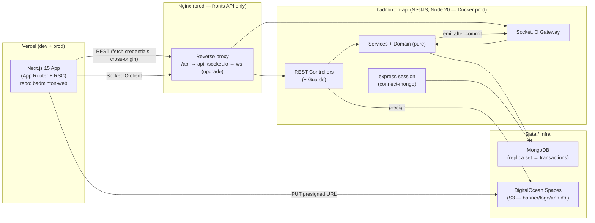

# System Architecture — Badminton Tournament Platform

> **Status:** Draft v0.2 (pivot stack)
> **Ngày:** 2026-06-03
> **Kèm:** [project-overview-pdr.md](project-overview-pdr.md)
> **Pivot note:** v0.2 chuyển stack Firebase/serverless → **NestJS + MongoDB + Socket.IO + DigitalOcean Spaces + Docker/Nginx**. Domain logic + business rule giữ nguyên. Map chi tiết: [architecture-pivot mapping report](../plans/reports/architecture-pivot-260603-1217-firebase-to-nestjs-mongo-mapping-report.md).

---

## 1. High-Level Architecture



**Quy tắc phân chia trách nhiệm:**

| Layer | Nhiệm vụ |
|---|---|
| **Next.js Client (`badminton-web`)** | UI, form validation (Zod), gọi REST (TanStack Query), subscribe Socket.IO realtime, upload file trực tiếp lên Spaces qua presigned URL |
| **Next.js Server (RSC)** | Render public page (cache), SEO, sitemap — fetch REST `GET /public/*` (no-auth) |
| **NestJS API (`badminton-api`)** | Mọi mutation có business rule: bốc thăm, sinh bracket, advance winner, withdrawal cascade, cấp role, mời trọng tài, payment. Authz qua Guards. Emit Socket.IO sau commit. |
| **NestJS Guards** | `AuthenticatedGuard` + `RolesGuard` (global) + `TournamentRoleGuard` (per-tournament). Public read = `@Public()`. Thay thế firestore.rules. |
| **MongoDB** | System of record. Multi-doc atomicity = session transaction (cần replica set). |

**Lý do giữ domain logic tách riêng (`src/domain/` pure):**
- Client không trust được → không có quyền ghi DB; mọi ghi qua REST endpoint có guard.
- `src/domain/bracket/*.ts` thuần (không import nestjs/mongoose) → unit test nhanh + portable. (Mục tiêu D2 cũ giờ thành hiện thực: domain đã pure ngay từ MVP.)

## 2. Tech Stack

| Layer | Choice | Version | Lý do |
|---|---|---|---|
| Frontend framework | Next.js | 15 (App Router) | RSC cho public page, SEO, đã chốt |
| UI library | shadcn/ui + Tailwind | latest | Accessible, dễ tuỳ biến, KISS |
| State client | TanStack Query + Zustand (tối thiểu) | latest | REST cache + realtime merge từ Socket.IO |
| Realtime client | socket.io-client | v4 | Subscribe room tournament/category/match |
| Forms | React Hook Form + Zod | latest | Type-safe, schema share giữa client + API (DTO) |
| Backend framework | **NestJS** | v10 (Node 20 + TS) | Module/DI/Guard rõ ràng, REST + WS gateway, testable |
| Auth | **express-session + Passport** | passport-local (email/password, **không Google OAuth**) | Session cookie `connect.sid` dùng chung REST + Socket.IO |
| Session store | **connect-mongo** | latest | Session trong Mongo, không cần Redis ở MVP |
| Password | **bcrypt** | latest | Hash mật khẩu |
| DB | **MongoDB** | 6+ (replica set) | Document store; transaction cần RS |
| ODM | **Mongoose** | v8 | Schema + index + session transaction |
| Realtime server | **Socket.IO** | v4 | Push score/bracket/court updates |
| Storage | **DigitalOcean Spaces** (S3-compatible) | — | Presigned PUT; `@aws-sdk/client-s3` + `s3-request-presigner` |
| Hosting FE | **Vercel (dev + prod)** | — | `badminton-web` ở cả dev lẫn prod trên Vercel |
| Hosting BE | **Docker + Nginx (prod)** | — | NestJS + Socket.IO persistent; Nginx reverse proxy + websocket upgrade; chỉ front api (không front web) |
| Local dev | **docker-compose** (mongo RS + api) + `next dev` (web) | — | Thay Firebase Emulator |
| CI/CD | GitHub Actions + Vercel + Docker build | — | Lint/typecheck/test/build cả 2 repo |
| Monitoring | Nginx/access log + pino (NestJS) + uptime ping | — | Đủ MVP |
| Language | TypeScript strict | — | |
| Testing | Jest (unit + e2e via supertest + mongodb-memory-server) + Playwright (E2E) | — | E2E ưu tiên cho bracket flow |

## 3. Domain Model (ERD)

```mermaid
erDiagram
    User ||--o{ TournamentRole : "được cấp"
    User ||--o{ Registration : "đăng ký"
    User ||--o{ Tournament : "tạo (organizer chính)"

    Tournament ||--|{ Category : "có"
    Tournament ||--o{ TournamentRole : "gán role"
    Tournament ||--o{ Court : "có sân"

    Category ||--o{ Bracket : "phiên bản"
    Category ||--o{ Registration : "nhận đăng ký"

    Bracket ||--|{ Match : "chứa"

    Match ||--|| MatchSide : "side_a (embedded)"
    Match ||--|| MatchSide : "side_b (embedded)"
    Match ||--o{ Game : "best-of-N (embedded)"
    Match }o--o| Court : "diễn ra"

    MatchSide }o--|{ Registration : "1-2 reg"

    User {
        string id PK "Mongo ObjectId"
        string email "unique, dùng login"
        string passwordHash "bcrypt, nullable nếu Google-only"
        string displayName
        string nationalId "12 số, unique, sensitive PII — nằm trong identity{}"
        enum gender "male|female"
        date dob
        string phone "nullable, sensitive — trong identity{}"
        string avatarUrl "nullable"
        string globalRole "athlete|organizer_capable|admin"
        timestamp createdAt
    }

    Tournament {
        string id PK
        string name
        string slug "unique URL slug"
        string description
        date startDate
        date endDate
        string location
        string bannerUrl "2000x1000, nullable (Spaces)"
        string logoUrl "logo giải, nullable (Spaces)"
        string rulesText "markdown, nullable"
        json sponsors "array of {id, tier, name, logoUrl, link, description}"
        json paymentConfig "{accountHolder, accountNumber, bankCode, transferMemoTemplate, qrUrl}"
        bool isPublic
        string ownerUserId FK
        enum status "draft|open|running|completed|cancelled"
        timestamp createdAt
    }

    Category {
        string id PK
        string tournamentId FK
        string code "unique trong tournament, vd MD19"
        string name "vd Đôi nam U19"
        int playerCount "1|2 (đơn/đôi)"
        enum genderRequirement "men_only|women_only|mixed_pair|unrestricted"
        enum format "single_elim|round_robin|group_ko"
        int bestOf "1|3|5"
        json formatConfig "vd {crossover:true} | RR:{} | group:{groupCount, qualifyPerGroup}"
        timestamp registrationDeadline
        int fee "VND, 0=free"
        int maxTeams "hard cap, đếm approved+pending"
        timestamp scheduleStartAt "nullable, set sau bốc thăm"
        int estimatedMinPerMatch "nullable, dùng để tính scheduledAt cho match"
        enum registrationStatus "not_open|open|closed"
        timestamp openedAt "nullable"
        timestamp closedAt "nullable"
        timestamp createdAt
    }

    Registration {
        string id PK
        string categoryId FK
        string tournamentId FK "denormalize cho query/authz"
        string userId FK "VĐV chính"
        string partnerUserId FK "nullable, dùng cho đôi"
        int seed "nullable, BTC nhập"
        enum status "pending|approved|rejected|withdrawn"
        int feeSnapshot "VND, snapshot lúc đăng ký"
        enum paymentStatus "unpaid|paid"
        timestamp paidAt "nullable"
        string paidMarkByUserId FK "nullable, ai đánh dấu đã thu"
        string teamPhotoUrl "nullable, BTC upload override (Spaces)"
        string createdByUserId FK "ai tạo: chính chủ hoặc organizer"
        enum createdMode "self|organizer_single|organizer_bulk"
        timestamp createdAt
        timestamp approvedAt "nullable"
        string approvedByUserId FK "nullable"
    }

    Bracket {
        string id PK
        string categoryId FK
        int version
        bool isActive
        timestamp drawnAt
        string drawnByUserId FK
    }

    Match {
        string id PK
        string bracketId FK
        string categoryId FK
        int round "1=R1, 2=QF, ..."
        int slotIndex
        json sideA "embedded MatchSide"
        json sideB "embedded MatchSide"
        json games "embedded Game[] (≤ bestOf)"
        enum winnerSide "A|B|null"
        string nextMatchId FK "nullable, match thắng đi tiếp"
        string courtId FK "nullable, gán ở Vận hành LIVE (không gán ở trang Lịch)"
        string refereeUserId FK "nullable, snapshot từ court.currentRefereeUserId khi assign court"
        string[] participantUserIds "denormalize tất cả VĐV 2 side"
        string[] participantRegistrationIds "denormalize"
        int order "thứ tự thi đấu, kéo đổi ở trang Lịch → tính lại scheduledAt"
        timestamp scheduledAt "dự kiến = startAt + (order/courtCount)*estimatedMinPerMatch"
        timestamp startedAt
        timestamp endedAt
        enum status "pending|in_progress|completed|walkover"
        bool isBye
    }

    MatchSide {
        string side "A|B (discriminator, embedded trong Match)"
        string registrationIdPrimary FK
        string registrationIdPartner FK "nullable"
        int gamesWon
    }

    Game {
        int gameNumber
        int scoreSideA
        int scoreSideB
        enum winnerSide "A|B"
        timestamp endedAt
    }

    Court {
        string id PK
        string tournamentId FK
        string name "vd Sân 1"
        string currentRefereeUserId FK "nullable, trọng tài đang ngồi sân"
        string currentMatchId FK "nullable, match đang diễn ra"
        enum status "available|busy"
        timestamp refereeAssignedAt "nullable"
    }

    TournamentRole {
        string id PK
        string tournamentId FK
        string userId FK
        enum role "organizer|referee"
        timestamp grantedAt
        string grantedByUserId FK
    }
```



### Quy tắc model

1. **`Registration` là khoá nối** giữa User và Category — KHÔNG dùng `userId` trực tiếp trong Match. Lý do: hỗ trợ đôi (2 user/side) + tracking withdrawal độc lập với hồ sơ user.
2. **`Bracket` versioned**: re-arrange = tạo bracket mới, set `isActive=true`, bracket cũ `isActive=false`. Không xoá.
3. **`Match.nextMatchId`** lưu sẵn lúc gen bracket → advance winner = O(1) update.
4. **`Match.isBye=true`** = match tự thắng cho side có đăng ký, side kia là phantom. `status` set `completed` ngay khi sinh bracket.
5. **`Match.sideA/sideB` + `games` embedded**: side luôn 2, game ≤ bestOf (≤5) → bounded, an toàn với giới hạn doc 16MB. `MatchSide.gamesWon` denormalize từ games để truy vấn nhanh. **Lợi:** mỗi mutation match đụng 1 document → transaction đơn giản; Socket.IO emit nguyên match doc.
6. **PII isolation**: `nationalId` + `phone` nằm trong subdoc `user.identity`, gắn `@Exclude()` (class-serializer) → mặc định KHÔNG trả về response. Chỉ owner/admin lấy qua endpoint riêng (`GET /users/me`, `GET /admin/users/:id`). `email` ở root vì cần cho login. (Mongo không có field-level security như cần, nên kiểm soát ở **serializer + service projection**.)
7. **`nationalId` uniqueness**: Mongo **unique index** `{ 'identity.nationalId': 1 }`. Race 2 user signup cùng nationalId → 1 trong 2 dính lỗi duplicate-key `E11000` → service map thành `NATIONAL_ID_ALREADY_REGISTERED`. (Không cần collection index riêng như `cccdIndex` cũ.)
8. **Withdrawal cascade**: khi `Registration.status = withdrawn`, service tìm tất cả Match có side chứa registration đó **với status `pending` hoặc `in_progress`** (KHÔNG đụng match `completed` — lịch sử bất biến), set `status=walkover`, side đối diện thắng + tự đẩy lên `nextMatch`. Match đang `in_progress` bị walkover → release court (`court.currentMatchId=null`). Đôi: 1 trong 2 VĐV rút = cả cặp `withdrawn`.
9. **`Match.refereeUserId`** (snapshot): set TỰ ĐỘNG khi organizer gán match vào court — copy từ `court.currentRefereeUserId` tại thời điểm assign. Là **gate** cho quyền nhập điểm: `userId == match.refereeUserId` mới score được. Organizer luôn override. Đổi `court.currentRefereeUserId` sau đó KHÔNG ảnh hưởng match đã snapshot (rule MVP).
10. **Quyền edit điểm**:
   - Referee: chỉ match được gán + trong 24h sau `endedAt`.
   - **Organizer: bất kỳ match nào, không giới hạn thời gian** — kể cả match đã `completed`.
   - Nếu edit thay đổi `winnerSide` của match đã advance: **CASCADE REVERT** toàn bộ dây chuyền các match downstream mà loser cũ đã tham gia, sau đó re-advance winner mới (mục 8.5).
   - UI **bắt buộc hiển thị confirm dialog** liệt kê tất cả match sẽ bị reset trước khi commit.
   - Mọi edit ghi audit log: `editedByUserId`, `previousScore`, `newScore`, `winnerChanged: bool`, `revertedMatchIds: string[]`.

## 4. MongoDB Schema (collection layout)

Dùng **collections phẳng** + reference ObjectId, embedding cho dữ liệu bounded. (Bỏ cây subcollection của Firestore.)

```
users
└── { _id, email(unique), passwordHash?, displayName, gender, dob, avatarUrl,
      globalRole: 'athlete'|'organizer_capable'|'admin',
      identity: { nationalId(unique idx), phone },        # @Exclude mặc định
      createdAt }

tournaments
└── { _id, name, slug(unique), description, startDate, endDate, location,
      bannerUrl?, logoUrl?, rulesText?, sponsors[], paymentConfig,
      isPublic, ownerUserId, status, createdAt }

tournamentRoles                                            # unique {tournamentId,userId,role}
└── { _id, tournamentId, userId, role: 'organizer'|'referee', grantedAt, grantedByUserId }

courts
└── { _id, tournamentId, name, currentRefereeUserId?, currentMatchId?, status, refereeAssignedAt? }

categories                                                 # unique {tournamentId,code}
└── { _id, tournamentId, code, name, playerCount, genderRequirement, format, bestOf,
      formatConfig, registrationDeadline, fee, maxTeams,
      scheduleStartAt?, estimatedMinPerMatch?, registrationStatus, openedAt?, closedAt?, createdAt }

registrations
└── { _id, categoryId, tournamentId, userId, partnerUserId?, seed?, status,
      feeSnapshot, paymentStatus, paidAt?, paidMarkByUserId?, teamPhotoUrl?,
      createdByUserId, createdMode, createdAt, approvedAt?, approvedByUserId? }

brackets
└── { _id, categoryId, version, isActive, drawnAt, drawnByUserId }

matches
└── { _id, bracketId, categoryId, round, slotIndex,
      sideA: { registrationIdPrimary, registrationIdPartner?, gamesWon },   # embedded
      sideB: { ... },                                                       # embedded
      games: [ { gameNumber, scoreSideA, scoreSideB, winnerSide, endedAt } ],# embedded
      winnerSide?, nextMatchId?, courtId?, refereeUserId?,
      participantUserIds[], participantRegistrationIds[],
      order, scheduledAt?, startedAt?, endedAt?, status, isBye }

auditLogs                                                  # immutable (service không update/delete)
└── { _id, tournamentId?, type, actorUserId, payload, at }
```

### Indexes cần thiết

| Truy vấn | Index |
|---|---|
| Login theo email | `users { email: 1 }` unique |
| Uniqueness nationalId | `users { 'identity.nationalId': 1 }` unique |
| Tournament theo slug | `tournaments { slug: 1 }` unique |
| Role của user trong tournament | `tournamentRoles { tournamentId: 1, userId: 1, role: 1 }` unique |
| Category code unique trong tournament | `categories { tournamentId: 1, code: 1 }` unique |
| Registration theo category + status (slot count, roster) | `registrations { categoryId: 1, status: 1 }` |
| Tất cả giải user X đăng ký | `registrations { userId: 1 }` |
| Tất cả match user X thi đấu (conflict warning) | `matches { participantUserIds: 1 }` |
| Match của 1 bracket | `matches { bracketId: 1 }` |
| Match sort theo vòng | `matches { categoryId: 1, round: 1, slotIndex: 1 }` |
| Match của referee | `matches { refereeUserId: 1, status: 1 }` |
| Audit theo tournament | `auditLogs { tournamentId: 1, at: -1 }` |

**Note về `code` Category:** unique enforce bằng compound unique index (`E11000` → map `CATEGORY_CODE_DUPLICATE`). Không cần read-all-then-check.

**Denormalize `participantUserIds` / `participantRegistrationIds`** trên Match: phục vụ schedule conflict warning bằng 1 query, và withdrawal cascade tìm match chứa registration.

## 5. NestJS structure (badminton-api)

```
src/
├── main.ts                        # session middleware + Passport + SocketIoAdapter + CORS(credentials) + helmet
├── app.module.ts                  # MongooseModule.forRoot(uri replicaSet), ConfigModule, ThrottlerModule, các feature module
├── common/
│   ├── guards/
│   │   ├── authenticated.guard.ts          # req.isAuthenticated() (session)
│   │   ├── roles.guard.ts                  # global role: admin / organizer_capable
│   │   └── tournament-role.guard.ts        # đọc tournamentRoles theo :tid param
│   ├── decorators/                         # @Public(), @Roles(), @TournamentRoles(), @CurrentUser()
│   ├── interceptors/serialize.interceptor.ts  # class-serializer, exclude PII
│   └── filters/domain-exception.filter.ts  # DomainError → HttpException (mã lỗi VN)
├── domain/                                 # PURE — KHÔNG import @nestjs/* hay mongoose
│   ├── bracket/
│   │   ├── single-elim-generator.ts        # input: registrations + seeds → BracketPlan
│   │   ├── build-crossover-seed-order.ts   # spec §7
│   │   ├── resolve-seeds.ts                 # spec §6
│   │   ├── bye-allocator.ts
│   │   ├── build-match-tree.ts             # gen R1..Rmax + nextMatchId
│   │   ├── advance-winner.ts               # input: match + winner → updates[]
│   │   ├── withdrawal-cascade.ts           # input: registration + bracket → updates[]
│   │   ├── cascade-revert.ts               # input: match + new winner → reset list + re-advance
│   │   ├── rearrange-swap.ts
│   │   └── types.ts                         # BracketPlan, MatchPlan, SidePlan — KHÔNG có Mongoose type
│   ├── scoring/
│   │   └── compute-match-winner.ts         # input: games[], bestOf → winnerSide
│   ├── scheduling/
│   │   └── compute-scheduled-at.ts         # input: matches[], startAt, mins, courtCount
│   └── validation/
│       ├── gender-requirement.ts           # men/women/mixed/unrestricted
│       ├── national-id-format.ts           # 12 số, all digits (đổi tên từ cccd-format)
│       ├── category-config.ts              # mixed_pair + playerCount=2 only
│       └── partner-eligibility.ts
├── schemas/                                # Mongoose schema + index (xem §4)
│   ├── user.schema.ts ... match.schema.ts (embed side+game), audit-log.schema.ts
├── modules/
│   ├── auth/                               # local strategy + session serializer + register/login/logout/forgot/reset
│   ├── users/                              # profile, admin user list, grant global role
│   ├── tournaments/                        # CRUD + detail + visibility + grant tournament role
│   ├── courts/                             # CRUD + assign-referee + release
│   ├── categories/                         # CRUD + lifecycle + schedule config
│   ├── registrations/                      # self/organizer/bulk + approve/reject/withdraw + payment + seed + team-photo
│   ├── brackets/                           # draw / rearrange / reset
│   ├── matches/                            # start/score/end/edit/preview-cascade/assign-court/reorder
│   ├── operations/                         # (compose courts+matches cho console; có thể nằm trong matches/courts)
│   ├── storage/                            # S3 presign (DO Spaces)
│   ├── realtime/                           # Socket.IO gateway + session-share middleware
│   └── public/                             # @Public() read endpoints (homepage, tournament, roster, bracket, schedule)
└── config/                                 # env schema (Mongo URI, session secret, Spaces keys, mail SMTP)
```

**Quan hệ với migration path cũ:** `functions/src/domain/` cũ → copy nguyên sang `src/domain/` (chỉ đổi `cccd-format.ts` → `national-id-format.ts`). `adapters/firestore/*` → service Mongoose / `*.repository.ts` dùng `@InjectModel` + `session`. `handlers/*` → controller route (map §2 mapping report).

## 6. Authorization model

### Quy tắc đọc dữ liệu (read)

| Resource | Cho phép read | Cơ chế |
|---|---|---|
| `users` (public fields: displayName, gender, avatar, dob) | mọi user đăng nhập | service projection (loại `identity`) |
| `users.identity` (nationalId, phone) | chính chủ + admin | endpoint riêng + guard |
| `tournaments` (isPublic=true) | mọi người, kể cả guest | `@Public()` `GET /public/*` |
| `tournaments` (isPublic=false) | organizer/participant của tid + admin | `AuthenticatedGuard` + service check |
| `categories` (meta) | theo rule tournament | như trên |
| `registrations` (chính chủ) | chính chủ — luôn xem được đăng ký của mình | service filter `userId == me` |
| `registrations` (toàn bộ roster approved) | **public CHỈ KHI** `registrationStatus=closed` AND `tournament.isPublic=true`; organizer/admin luôn xem mọi status | service nhánh điều kiện |
| `registrations` (sensitive: paymentStatus, feeSnapshot, paidMarkByUserId) | organizer + chính chủ + admin (không public dù closed) | serializer @Exclude theo viewer |
| `matches` | theo rule tournament + chỉ khi bracket đã sinh | service |
| `auditLogs` | organizer + admin | guard |

**PII**: serializer loại bỏ `identity.nationalId`, `identity.phone`, `email` khỏi mọi response trừ owner/admin. KHÔNG log raw nationalId vào access log.

### Quy tắc ghi (write) — chỉ qua API có guard

Không có khái niệm "client ghi DB trực tiếp" (khác Firestore). Mọi mutation = REST endpoint:
- Self register / update profile → `AuthenticatedGuard` + service verify `userId == me`.
- Approve/draw/score/assign → guard role tương ứng (organizer/referee).

### Guards (thay firestore.rules)

```ts
// authenticated.guard.ts — chặn nếu chưa login (session)
canActivate(ctx) { return ctx.switchToHttp().getRequest().isAuthenticated(); }

// roles.guard.ts — global role (admin / organizer_capable) đọc từ req.user.globalRole
// tournament-role.guard.ts — đọc tournamentRoles theo :tid + req.user.id, so với @TournamentRoles('organizer')
// @Public() — bỏ qua mọi guard, dùng cho module public/
```

So với rules cũ: `isSignedIn()` → `AuthenticatedGuard`; `isAdmin()` → `RolesGuard('admin')`; `isOrganizer(tid)` → `TournamentRoleGuard('organizer')`; "public read if isPublic" → `@Public()` + service điều kiện.

## 7. Auth flow (session + Passport)

```
[Client login form]
  → POST /auth/login { email, password }   (fetch credentials: 'include')
  → Passport local strategy: tìm user theo email, bcrypt.compare
  → session serialize userId → cookie connect.sid (HTTP-only, Secure, SameSite)
  → trả { user } (đã loại PII)

[Mọi request sau]
  → cookie connect.sid → express-session load session từ connect-mongo → req.user

[Socket.IO]
  → handshake dùng cùng cookie connect.sid (session-share middleware) → biết user
```

- `passport-local` (email + password bcrypt). **KHÔNG Google OAuth** — đăng nhập 100% qua API session (email/password). `POST /auth/register` thu đủ field hồ sơ 1 lần (không cần complete-profile).
- Session store `connect-mongo` (collection `sessions`), TTL.
- CORS: `credentials: true`, origin = web Vercel domain. Web (Vercel) ↔ api (domain riêng) = **cross-origin** → cookie **`SameSite=None; Secure`** (bắt buộc HTTPS 2 phía).
- Forgot password: tự xử lý — `POST /auth/forgot-password` sinh token (hash lưu DB, TTL 1h) + gửi email (nodemailer/SMTP); `POST /auth/reset-password { token, newPassword }`.

## 8. Data flow — Key journeys

### 8.1 Category lifecycle (3 trạng thái)

```
[Organizer setup]
  Tạo Category → registrationStatus = 'not_open'
    ↓ POST /categories/:cid/registration/open
  registrationStatus = 'open', openedAt = now
    → VĐV đăng ký được khi: tournament.isPublic=true AND now < deadline AND (approved+pending) < maxTeams
    ↓ POST /categories/:cid/registration/close   [GUARD: pending count = 0]
  registrationStatus = 'closed', closedAt = now
    → Không nhận đăng ký mới
    → Roster approved hiển thị PUBLIC (kèm ảnh đội)
    → BTC sẵn sàng: thêm/sửa teamPhotoUrl, nhập seed, bốc thăm
  → (sau bốc thăm: implicit "drawn" — Bracket.isActive=true)
```

**Transition rules (service enforce):**
- `not_open → open`: cho phép.
- `open → closed`: chỉ khi count `pending == 0` → reject "Còn N pending..." nếu > 0.
- `closed → open`: chỉ khi chưa có bracket active.
- Sau bốc thăm: không transition flow thường (admin override endpoint riêng).

**Đăng ký mới (`POST /categories/:cid/registrations`):**
1. `tournament.isPublic == true`
2. `category.registrationStatus == 'open'`
3. `now < category.registrationDeadline`
4. **Slot check**: `count(status IN [pending, approved]) < maxTeams` — đọc + ghi trong **cùng Mongo transaction** chống race.
5. Mixed doubles: gender check
6. Snapshot `feeSnapshot = category.fee`, `paymentStatus='unpaid'`
7. Default `status='pending'`

### 8.2 Signup với nationalId uniqueness

```
[Client signup form]
  → Validate format: nationalId = exactly 12 digits
  → POST /auth/register { email, password, displayName, nationalId, gender, dob, phone? }

[API auth/register]
  → Validate DTO (Zod/class-validator), nationalId 12 số
  → bcrypt hash password
  → insert users { ..., identity:{ nationalId, phone } }
      - Nhờ unique index { 'identity.nationalId': 1 }: nếu trùng → Mongo E11000
        → throw NATIONAL_ID_ALREADY_REGISTERED (KHÔNG cần transaction kiểm tra trước)
      - email trùng → E11000 → EMAIL_ALREADY_USED
  → tạo session (auto-login) → set cookie
  → Audit log signup

[Client]
  → On error NATIONAL_ID_ALREADY_REGISTERED:
      "CCCD này đã được đăng ký. Vui lòng đăng nhập hoặc dùng quên mật khẩu."
      (KHÔNG tiết lộ email/owner cũ)
```

**Lưu ý:** unique index làm việc atomic ở tầng DB → không còn race window như đọc-rồi-ghi. Không cần xoá "ghost auth" như Firebase (không có auth user tách rời).

**Auth provider:** chỉ email/password (Passport local). KHÔNG Google OAuth → không cần bước "bổ sung hồ sơ" (register thu đủ field 1 lần).

**Admin update nationalId** (P5+): `PATCH /admin/users/:id/national-id` — đổi field, unique index tự chống trùng.

### 8.3 Bốc thăm bracket

**Tiền đề:** BTC đã `closed` category + (optional) set seed ở phase "Config đội".

```
[Organizer UI] → POST /categories/:cid/bracket/draw   # chỉ cần categoryId
  ↓
[API brackets.draw]
  → TournamentRoleGuard(organizer)
  → Read category → assert status='closed'
  → Read approved registrations
  → seededCount = regs.filter(seed != null).length
  → mode = seededCount > 0 ? 'seeded' : 'random'    # AUTO-DETECT
  → Validate (regs >= 2, seeded unique + in [1,N])
  → domain/bracket/single-elim-generator(regs, mode) → BracketPlan
  → Mongo session transaction:
      - mark old active bracket isActive=false
      - insert bracket (version=max+1, isActive=true)
      - insert matches (sideA/sideB + games[] embedded)
  → Audit log (mode, seedSnapshot)
  → emit Socket.IO 'bracket:updated' → room category:{cid}
  ↓
[Client] nhận event → refetch/merge bracket
```

**`PATCH /registrations/:rid/seed { seed | null }`** — gọi ở phase config đội:
- Guard: organizer + `registrationStatus='closed'` + chưa có bracket active.
- `seed=null` → clear. Validate integer ≥ 1. KHÔNG validate uniqueness ở set level (chỉ ở draw).

### 8.4 Nhập điểm + kết thúc trận

```
[Referee UI]
  → POST /matches/:mid/games { gameNumber, scoreA, scoreB }
    → guard: userId == match.refereeUserId OR isOrganizer(tid)
    → push/update games[] embedded; recompute side.gamesWon
    → emit 'match:updated' → room match:{mid} + category:{cid}
  ... (lặp N game)
  → POST /matches/:mid/end
    → same guard
    → compute-match-winner(games, bestOf) → winnerSide
    → set status=completed, winnerSide, endedAt
    → if nextMatchId: fill side đúng của nextMatch = winner registrations (advance-winner)
    → if courtId: release court (currentMatchId=null, status=available)
    → tất cả trong 1 Mongo transaction
    → Audit log; emit 'match:updated' (cả match hiện tại + nextMatch) + 'court:updated'
```

### 8.5 Organizer edit điểm — cascade revert chain

Match M đã `completed`, winner cũ đã đẩy lên `nextMatch` (có thể đã đấu tiếp). Organizer sửa điểm → winner đổi.

**Thuật toán `cascade-revert.ts` (domain, pure):**

```
function cascadeRevert(matchM, newWinnerSide, allMatches):
  affected = []
  cursor = matchM.nextMatchId
  loserSideOld = winner cũ của M (giờ thành loser)

  while cursor != null:
    next = allMatches[cursor]
    if next chứa registration của loserSideOld:
      affected.push(next)
      next.status='pending'; next.winnerSide=null; next.startedAt=null; next.endedAt=null; next.games=[]
      # side chứa loser cũ → set lại TBD
      if next.winnerSide-cũ != null:
        cursor = next.nextMatchId
        loserSideOld = winner cũ của next
      else: break
    else: break
  return { affected }
```

**Flow:**

```
[Organizer UI — "Edit điểm" trên M]
  → POST /matches/:mid/score/preview-cascade { newGames }
    → dry-run: compute affected matches
    → return list { matchId, round, currentStatus, willBecome }

[UI confirm dialog] "Sửa điểm sẽ reset 3 trận: QF#2, SF#1, F. Tiếp tục?"

[User confirms]
  → PATCH /matches/:mid/score { games, newWinnerSide }
    → guard: organizer (anytime) | referee (24h sau endedAt)
    → compute cascade affected list
    → Mongo session transaction:
        * cập nhật games[] + side.gamesWon + winnerSide của M
        * mỗi affected match: status=pending, clear winnerSide/startedAt/endedAt, games=[], side chứa loser cũ → ghi winner mới (chain advance)
        * re-advance từ M → nextMatch
    → Audit log (revertedMatchIds, oldWinner, newWinner)
    → emit 'match:updated' cho mỗi match đổi + 'bracket:updated'
```

**Constraint:**
- Cascade KHÔNG đụng match không liên quan.
- Match `in_progress` trong chain cũng reset → UI cảnh báo mạnh hơn.
- Mongo transaction không có limit 500 ops; lo về runtime + doc size (mỗi match 1 doc, embed gọn) → cap N ≤ 128 vẫn an toàn dư.

### 8.6 Operations Console — model 2 cấp

**Cấp 1 — Gán trọng tài vào Court:**
```
PATCH /tournaments/:tid/courts/:cid/referee { refereeUserId | null }
  → guard organizer + validate refereeUserId có role 'referee' trên tournament
  → court.currentRefereeUserId = refereeUserId; refereeAssignedAt=now
  → Audit + emit 'court:updated'
```

**Cấp 2 — Gán Match vào Court:**
```
POST /matches/:mid/assign-court { courtId }
  → guard organizer
  → Mongo transaction:
      validate court.status=='available' AND court.currentMatchId==null
      validate court.currentRefereeUserId != null (sân phải có trọng tài)
      validate match.status=='pending'
      match.courtId=courtId; match.refereeUserId=court.currentRefereeUserId  # SNAPSHOT
      court.currentMatchId=matchId; court.status='busy'
  → Audit + emit 'court:updated' + 'match:updated'
```

**Auto-release khi match end:** trong `POST /matches/:mid/end` transaction — nếu `courtId != null` → court.currentMatchId=null, status='available'; `currentRefereeUserId` GIỮ NGUYÊN.

**Đổi trọng tài khi match đang chạy:** đổi `court.currentRefereeUserId` KHÔNG đụng `match.refereeUserId` đang chạy (snapshot — rule MVP).

**Referee UI:** `GET /matches?refereeUserId=me&status=pending,in_progress` (hoặc qua module matches) → chỉ thấy match được gán.

### 8.7 Withdrawal cascade

**Rule:** Match `completed` của VĐV rút → GIỮ NGUYÊN. Chỉ `pending`/`in_progress` mới walkover.

```
POST /registrations/:rid/withdraw
  → guard owner | organizer
  → set registration.status=withdrawn
  → domain/bracket/withdrawal-cascade(reg, activeBracket):
      find matches có side chứa reg AND status IN (pending, in_progress)
      for each: status=walkover, winnerSide=đối diện, endedAt=now, games=[]
      propagate winners lên chain via nextMatchId (đệ quy)
  → Mongo transaction batch updates (+ release court nếu match in_progress)
  → Audit (withdrawnByUserId, affectedMatchIds, propagationChain)
  → emit 'match:updated' (mỗi match) + 'bracket:updated'
```

**Đôi:** 1 trong 2 VĐV rút → cả cặp (apply cho registration đôi). **Edge:** nhiều VĐV cùng rút → người còn lại đẩy lên thắng; audit ghi chain.

### 8.8 Payment tracking

```
POST /registrations/:rid/mark-paid   → organizer: paymentStatus=paid, paidAt=now, paidMarkByUserId=me, audit
POST /registrations/:rid/unmark-paid → organizer: revert unpaid, clear paidAt + paidMarkByUserId
```
**KHÔNG ràng buộc approve flow.** Filter UI: "Approved & unpaid", v.v.

### 8.9 Schedule config + tính scheduledAt

```
POST /categories/:cid/schedule { startAt, estimatedMinPerMatch }
  → guard organizer + bracket phải exist
  → category.scheduleStartAt + estimatedMinPerMatch
  → read all non-bye matches bracket active (sort round ASC, slotIndex ASC)
  → domain/scheduling/compute-scheduled-at:
      match.scheduledAt = startAt + floor(matchIndex / courtCount) * estimatedMinPerMatch (phút)
  → Mongo batch update + audit
```
**Note:** `courtCount` = số court hiện tại. Đổi số sân sau KHÔNG auto re-compute (gọi lại endpoint).

### 8.10 Gender requirement validation per category

`domain/validation/gender-requirement.ts` (pure) — logic giữ nguyên hoàn toàn:

```
validate(category, primaryUser, partnerUser?):
  playerCount==1: partner phải null;
    men_only→male; women_only→female; unrestricted→true; mixed_pair→INVALID config
  playerCount==2: partner bắt buộc; không tự ghép;
    men_only→both male; women_only→both female; mixed_pair→1 male+1 female; unrestricted→true
```

Áp dụng ở `create-registration` (self), `organizer-create` (single), `organizer-bulk` (từng dòng). UI filter client + server validate.

### 8.11 Organizer bulk create registration

```
POST /tournaments/:tid/registrations/bulk { rows: [{categoryId, userId, partnerUserId?}] }
  → guard organizer
  → Mongo session transaction (hoặc per-row tách — xem note):
    for each row độc lập try:
      resolveUser(s) tồn tại
      read category → registrationStatus == 'open'
      validate gender-requirement
      slot check với running counter (DB count + previous successful rows trong batch)
      check duplicate (user đã có reg active trong category)
      insert registration { status='approved', paymentStatus='unpaid', feeSnapshot,
                            createdByUserId=organizer, createdMode='organizer_bulk',
                            approvedAt=now, approvedByUserId=organizer }
      results.success.push(...)
    catch: results.errors.push({rowIndex, code, message})
  → Audit { batchId, total, success, errors }
  → return { success[], errors[] }
```

**Partial commit:** mỗi row thành công vẫn lưu dù row khác lỗi. (Nếu dùng 1 transaction cho cả batch thì partial-commit cần per-row transaction/no-transaction insert — MVP: insert từng row không bao 1 transaction tổng, slot race chấp nhận running-counter + unique guard; cap 50 rows/batch.)

## 9. Non-functional considerations (MVP scope)

| Yêu cầu | Mục tiêu | Cách đạt |
|---|---|---|
| Trang public render | < 1.5s p95 | RSC + HTTP cache (Nginx/Vercel), stale-while-revalidate |
| Realtime score update | < 3s p95 (thực tế < 1s) | Socket.IO push trực tiếp sau commit |
| Bracket gen 32 VĐV | < 2s | 1 Mongo transaction, batch insert |
| Concurrent referee nhập điểm | OK 10 trận song song | Mỗi match 1 doc → không lock chéo |
| Browser support | Chrome / Safari / Firefox latest 2 | Modern only |
| Mobile responsive | ≥ iPhone SE | Tailwind responsive, test 360px |
| A11y | WCAG AA cho form chính | shadcn/ui |
| PII / nationalId bảo vệ | Không leak ra response, không log raw | `identity` subdoc + @Exclude serializer; mask khi log |
| nationalId uniqueness | 100% chống trùng | Unique index `users.identity.nationalId` |
| Mongo transaction | Hỗ trợ multi-doc atomic | **Replica set bắt buộc** (dev RS 1-node, prod RS thật) |

## 10. Folder structure (Next.js app — badminton-web)

```
fb-tournament-fe/   (= badminton-web)
├── app/
│   ├── (public)/
│   │   ├── page.tsx                  # Trang chủ list giải
│   │   ├── giai/[slug]/page.tsx
│   │   └── giai/[slug]/[categoryCode]/bracket/page.tsx
│   ├── (auth)/
│   │   ├── login/page.tsx
│   │   ├── register/page.tsx
│   │   └── forgot-password/page.tsx
│   ├── (app)/
│   │   ├── trang-chu/page.tsx
│   │   ├── giai/[slug]/quan-ly/...
│   │   ├── giai/[slug]/dieu-hanh/page.tsx   # Operations Console
│   │   ├── trong-tai/page.tsx
│   │   ├── trong-tai/[matchId]/page.tsx
│   │   └── ho-so/page.tsx
│   ├── api/                          # Route handlers (proxy/SSR cookie nếu cần)
│   └── layout.tsx
├── components/{ui,tournament,bracket,match,operations,public,shared}/
├── lib/
│   ├── api/                          # REST client (fetch wrapper, credentials) + TanStack Query hooks
│   ├── socket.ts                     # socket.io-client + room subscribe helpers
│   ├── validators/                   # Zod schemas (share shape với API DTO)
│   └── utils/
├── public/
├── docs/
└── plans/
```

> **Backend `badminton-api`** là repo riêng (NestJS, §5). `badminton-web` chỉ giao tiếp qua REST + Socket.IO; không import code backend trực tiếp (share type qua package types/OpenAPI nếu cần — P5+).

## 11. Deployment

**Web (`badminton-web`) — Vercel cho cả dev lẫn prod:**
- Env: `NEXT_PUBLIC_API_URL`, `NEXT_PUBLIC_SOCKET_URL` (trỏ domain api prod). Dev: `next dev` hoặc Vercel preview.
- Web KHÔNG nằm sau Nginx; gọi thẳng api domain → **cross-origin** (cookie `SameSite=None;Secure`, CORS credentials).

**API (`badminton-api`) — Docker + Nginx:**
```
[Nginx reverse proxy — chỉ front API]
  /api           → NestJS container
  /socket.io     → NestJS container (proxy_set_header Upgrade/Connection cho websocket)
[MongoDB]        → replica set (transaction)
[Sessions]       → connect-mongo (cùng Mongo)
[Spaces]         → external (DigitalOcean), bucket prefix tournaments/{tid}/...
```
- Dev api: `docker-compose up` (mongo replica-set 1 node + api). Spaces dev bucket hoặc MinIO.
- TLS: Nginx (Let's Encrypt) — bắt buộc HTTPS để cookie `SameSite=None;Secure` hoạt động cross-origin với web Vercel.
- Env/secret: Mongo URI, SESSION_SECRET, Spaces keys, SMTP — qua env file/secret manager, không commit.
- Mongo RS: bắt buộc cho transaction (bốc thăm, cascade, end-match).

## 12. Open architectural decisions (cần sau MVP)

1. **Ranking storage** (P6): aggregate-on-write vs on-read.
2. **Audit log retention**: TTL index / archive sang Spaces sau X tháng.
3. **i18n**: next-intl từ đầu hay sau.
4. **Notification transport**: in-app (Mongo collection + Socket.IO) đủ MVP; email/push sau.
5. **Socket.IO scaling**: multi-instance cần **Redis adapter** (defer P5+; MVP single api instance).
6. **Bracket > 128 VĐV**: vẫn 1 transaction (Mongo không limit 500 ops) nhưng cần đo runtime; sharding sau.

---

## Resolved (2026-06-03)

- ✅ Spaces: 1 bucket, prefix `tournaments/{tid}/...`.
- ✅ Auth: chỉ email/password qua API session — **bỏ Google OAuth**.
- ✅ Web hosting: **Vercel cho cả dev + prod**; Docker+Nginx chỉ cho api.

## Unresolved

- Có cần payment gateway từ P5 không? (PDR out of scope, xác nhận lại với BTC pilot.)
- Socket.IO multi-instance (Redis adapter) — defer P5+.
